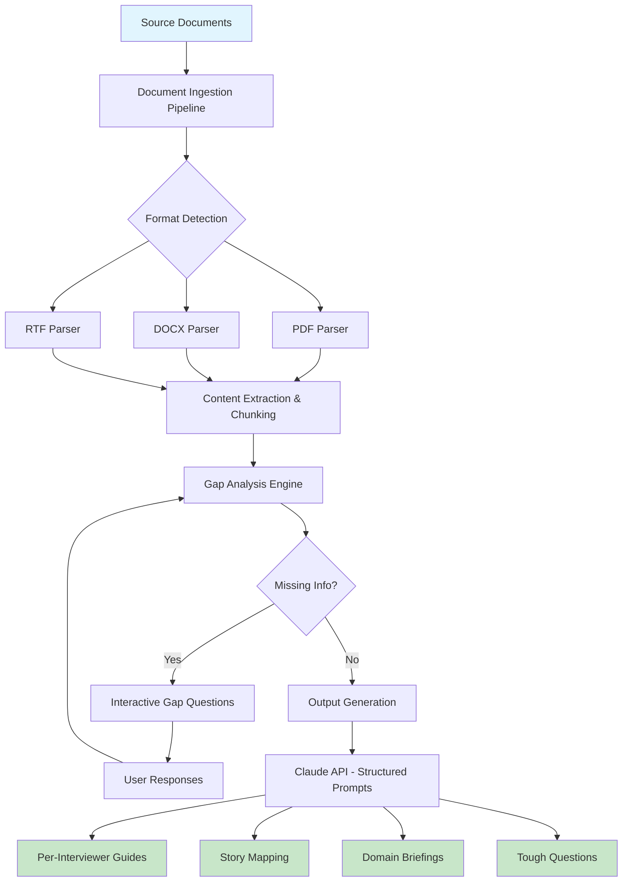

# Product Leader Interview Preparation Agent

An AI-powered system that transforms unstructured company research into
targeted interview preparation materials. Built for product leaders
preparing for senior/executive roles at enterprise companies.

## The Problem

Preparing for senior product interviews requires synthesizing 15-30 documents
(job descriptions, company filings, interviewer profiles, product documentation,
industry analysis) into actionable preparation materials. Doing this manually
takes 20+ hours per company. This agent does it in under 30 minutes.

## What It Does

Given a folder of source documents and a role context file, the agent generates:

1. **Per-interviewer prep guides** — Tailored talking points for each person
   you'll meet, based on their background and likely focus areas
2. **Story mapping** — Matches your experience to the role's requirements,
   identifying which stories to tell to which interviewer
3. **Domain briefings** — Deep-dive materials on the company's products,
   competitive landscape, and technical architecture
4. **Tough questions preparation** — Anticipated difficult questions with
   structured response frameworks

## Architecture

## Key Design Decisions

### Role-Agnostic Architecture
The system isn't hardcoded to any specific company or role. Adding a new
interview prep requires three steps:
1. Create a folder with source documents
2. Write a role context file (company, role, interviewers, focus areas)
3. Update the config to point to the new folder

This was a deliberate choice after I initially built it for a single company
and realized the pattern was universal.

### Interactive Gap Analysis
Rather than generating outputs from incomplete information, the system first
analyzes all source documents, identifies genuine information gaps, and asks
targeted questions via API calls. Responses are persisted so you don't have
to re-answer if you run the agent again.

### Cost-Conscious API Usage
Each run costs between $0.50 (lean document set) and $2.50 (research-heavy
context with 25+ documents). The system includes:
- Smart cooldowns for rate limiting
- Run logging with cost tracking per session
- Dry-run mode for testing without API consumption

## Tech Stack

- **Python 3.9+** — Core application
- **Claude API (Anthropic)** — LLM backbone for analysis and generation
- **Document parsing** — Support for PDF, DOCX, RTF formats
- **Persistent storage** — Gap analysis responses saved locally

## What I Learned

Building this taught me several things about working with LLMs in production:

- **Document analysis before generation**: Having the system thoroughly read
  existing materials before identifying gaps dramatically reduced generic output.
  The first version just generated checklists. The current version asks genuinely
  insightful questions because it knows what's already covered.

- **Cost management is a product decision**: The difference between a $0.50 run
  and a $2.50 run is mostly about how aggressively you chunk documents. I chose
  to optimize for output quality over cost, but built in dry-run mode so users
  can validate their setup before spending.

- **Prompts are product specs**: The quality of output is almost entirely
  determined by prompt engineering. I iterated through 12+ versions of the
  core prompts before landing on ones that consistently produced non-generic,
  company-specific preparation materials.

## Status

Actively maintained. Used for real interview preparation at multiple companies.
